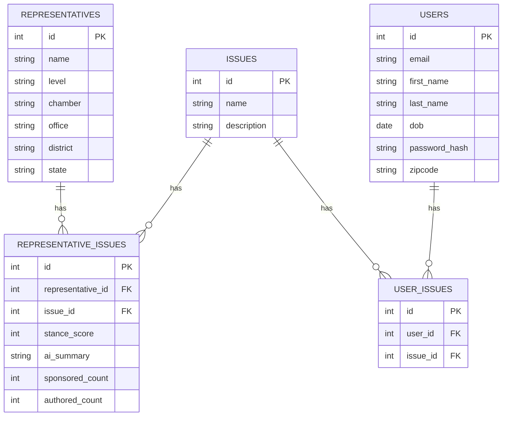

# Civic Data Platform

A full-stack web application for exploring elected representatives — city, state, and federal — and the policy issues they engage with. Built as a hands-on learning project, with a long-term goal of making political information more objective, accessible, and visual.

## Current Features
- Browse and search representatives by level (city/state/federal), chamber, state, and district, with a React frontend
- View policy issues and their connection to specific representatives
- User accounts with secure signup and JWT-based authentication
- Seeded with real data: all 100 U.S. Senators, the full NY congressional House delegation, NY State Senate/Assembly leadership, NY and federal executive officials, and the U.S. Supreme Court
- Open States API integration proof-of-concept — fetches a legislator's recent sponsored bills

## Tech Stack
- **Backend:** FastAPI, Pydantic, SQLAlchemy, PostgreSQL
- **Frontend:** React
- **Auth:** JWT (JSON Web Tokens) via python-jose, password hashing via Passlib (bcrypt)

## Roadmap
- Fully reliable Open States integration — currently a working proof-of-concept, being debugged for consistent results across all representatives
- Legislative activity tracking — bills sponsored, cosponsored, or authored by each representative per issue
- AI-generated issue stances — use an LLM to analyze a representative's voting/legislative history on a given issue and generate a stance score (left–right scale) plus a short summary, with sourcing
- Data visualization — charts and dashboards (e.g., "which representatives have sponsored the most legislation on healthcare"), so users can compare officials' records at a glance
- Election awareness tools — surface upcoming elections relevant to the user's location
- Deployment — move from local development to a hosted environment (e.g., AWS RDS + Elastic Beanstalk)

## What I learned
This project was built to get hands-on experience with:
- Designing a normalized relational database schema (including many-to-many relationships via junction tables and database-level constraints)
- Building a RESTful API with clean separation between models, schemas, and routes
- Implementing authentication from scratch
- Integrating a third-party API and debugging real API contract issues (missing required parameters, environment variable configuration)
- Working with real government and legislative data

## Database Schema

